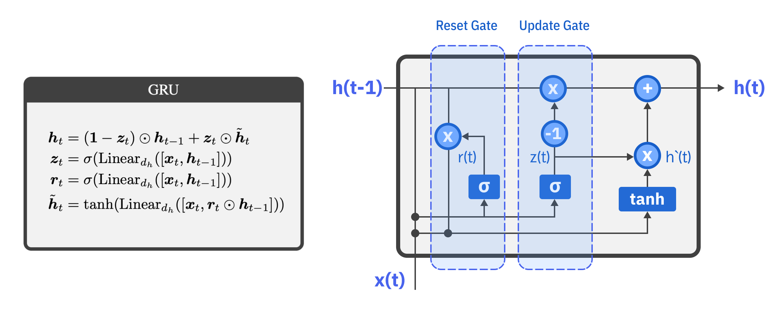
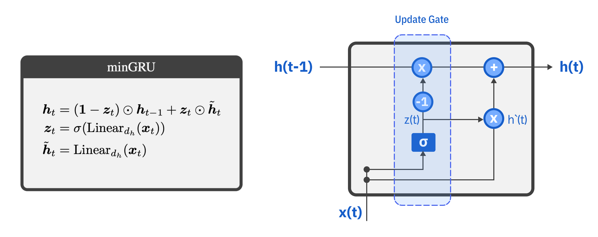
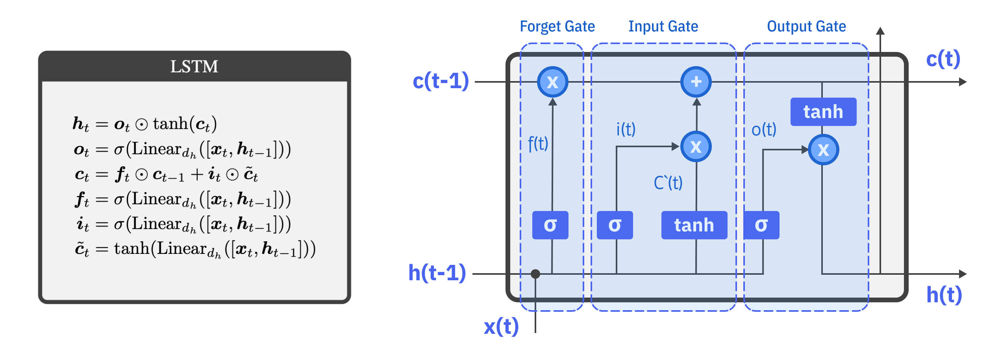
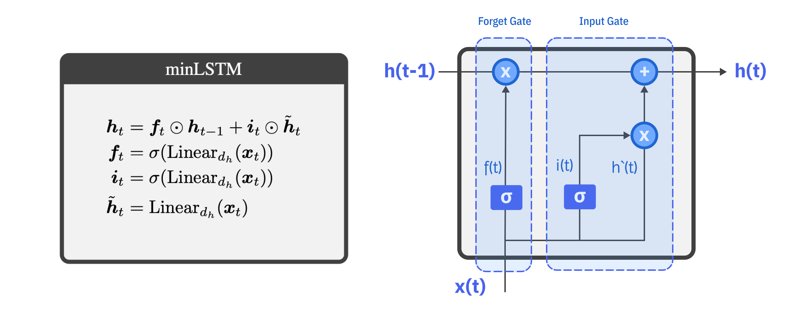

# Were RNN all we Needed ?

using the suggested models which outperform the original models like LSTM, GRU and some transformer application , with size and performance.

using min versions of (GRU,LSTM) with the power of parallel , compare it with the original models from Pytorch.

Comparison :

| Model | Original | Minimal |
| --- | --- | --- |
| GRU |  |  |
| LSTM |  |  |

See more details in code :

[GRU implementation details](gru_coded_details.ipynb)

[LSTM implementation details](lstm_coded_details.ipynb)

## References

[`Were RNN Is All We Needed`](https://arxiv.org/pdf/2410.01201)
